# multiplayer-cli

**Share one AI coding session with your team.**

You run a Claude Code / Codex / Copilot session on your machine. Your teammates
join with a link. Everyone sees the same conversation, anyone can suggest what
to ask next, and nothing is sent to the model until the group agrees.

<p align="center">
  
</p>

**[multiplayer-cli.dev →](https://fathyshalaby.github.io/multiplayer-cli/)** — the short version, with the demo running.

## Why

Pair programming with an AI is usually one person driving and everyone else
reading over a shoulder. Or worse: three people running three private sessions
that each learn a third of the context.

`mpx` makes the session itself the shared thing. One conversation, one context,
one place the work happens — and a vote in front of it, so the group decides
together what actually gets sent.

## Try it in 30 seconds

```bash
npx github:fathyshalaby/multiplayer-cli share
```

That is the whole setup. It finds whichever coding CLI you are already signed
into, starts a room, and prints a link to paste into chat:

```
  amber-ridge-04   claude-code  ·  ~/work/api
  found `claude` on your PATH
  prompts: majority+veto 45s   tools: claude-code's own permissions

  Send this to your team:

    http://192.168.1.20:7777/s/amber-ridge-04#t=Kf3nQ8vLm2
```

Whoever opens that link gets a seat — **in the browser, with nothing installed
and no API key** — or the one-line command to join from a terminal.

Then type to suggest, `/y` to agree. That is the whole interface.

> **No coding CLI installed?** It still runs, on an offline demo backend, so you
> can see how a room works before anything is real.
>
> **Not on npm yet.** Once it is published, `npm install -g multiplayer-cli`
> will give you the shorter `mpx` command. Until then use the `npx github:` form
> above — the rest of these docs write `mpx` for brevity.

Requires Node 20.11+. One dependency. Only the host needs any of this.

## How it works

```
   alice ─┐
   bob   ─┼──► room server ──► consent gate ──► the one AI session
   carol ─┘        ▲                 │
                   └── votes ────────┘
```

The host runs the room. Everyone else is a thin seat: they never talk to the
model, they propose and vote, and the room streams one response to everyone.
Every turn runs on the host's account, on the host's machine.

Four things follow from that:

**Typing is suggesting.** In a gated room a line of text is a proposal, not a
message. It gets an id (`#4`), a tally, and usually a countdown.

**The room votes.** `/y` approves. `/n` rejects, with an optional reason that
becomes the recorded justification. `/amend` rewrites a proposal and clears its
votes, because people approved the old wording.

**Side chat is free.** `/say let's ask it to compare the two first` reaches the
room and never touches the model or the context window.

**Everything is recorded.** Each session writes `.mpx/<room>.jsonl`: who
proposed what, who approved, who vetoed and why. Replay it with
`mpx transcript`.

## Works with what you already have

| | |
|---|---|
| **Claude Code · Codex · Copilot · OpenCode · Gemini · Cursor · Aider · Amp** | whichever you are signed into |
| **Anthropic API** | if you would rather use a key |
| **Offline demo** | no key, no spend, a full dry run of a room |

No API key needed for the room itself — it runs on whatever coding CLI the host
already pays for. See [Backends](./docs/backends.md).

## Decide how you decide

| Preset | A prompt is sent when | Good for |
|---|---|---|
| `solo` | immediately — no vote | a shared screen with no ceremony |
| `pair` | everyone consents, 20s timer, any veto stops it | two or three people |
| `team` *(default)* | a majority agrees, 45s timer | a working group |
| `strict` | everyone actively says yes, no timers | production, or an audience you don't know |
| `host` | the host says so | demos and workshops |
| `round-robin` | whoever holds the mic proposes | structured sessions |

```bash
mpx share --policy strict
```

Details in [Deciding together](./docs/deciding.md).

## Beyond the basics

None of this is required. A room works with none of it.

**Vote on the model's tool calls.** When the assistant wants to run
`bash: rm -rf build/`, that becomes a proposal like any other and the turn
genuinely blocks until the room answers. A denial goes back to the model as a
decision, not an error. *(On backends where mpx owns the agent loop — see
[Backends](./docs/backends.md).)*

**Try one prompt three ways at once.** `/race 3 make the retry logic
exponential` runs it in three parallel git worktrees. Everyone sees a diff per
lane and votes on which one lands:

```
  ✓ A  3 files +64 -12        ⚑ #4 land lane A
  ·  B  finished without changing anything
  ✓ C  1 file +8 -3           ⚑ #5 land lane C
```

Voting all of them down is a legitimate answer — you found out that none of the
three approaches was right, in the time it took to try one.
See [Racing](./docs/racing.md).

**Let the agent ask you.** Every gate above is the room interrupting the agent.
This is the other direction: the agent hits a real fork and stops to ask which
way, *before* spending the work.

```
  ⑂ codex asks the room to pick a direction
    Should the v1 API keep working after this change?

    ⑂ #2 a — Shim it      keep v1 alive behind an adapter
    ⑂ #3 b — Migrate      drop v1 and update every caller
```

*"Must v1 keep working?"* is a decision, not a fact — no amount of running the
code settles it. See [Crossroads](./docs/crossroads.md).

**Traffic is end-to-end encrypted, with forward secrecy.** The token in the
share link authenticates a key exchange rather than being the key, so a relay or
proxy in the path moves ciphertext it cannot read — and a recording made today
stays unreadable even if the link leaks tomorrow. The token never goes on the
wire. See [Security model](./docs/security.md).

## Documentation

**[Start with the docs index →](./docs/README.md)** — a glossary and an ordered
reading path.

| | |
|---|---|
| [Getting started](./docs/getting-started.md) | install, share, join, take a turn |
| [Deciding together](./docs/deciding.md) | the voting rules and how to tune them |
| [Backends](./docs/backends.md) | which AI CLI runs the session |
| [Reaching your team](./docs/relay.md) | LAN, relays, tunnels |
| [Security model](./docs/security.md) | what the token protects, and what it does not |

## Commands

| | |
|---|---|
| `mpx share` | start a room and print a link to send |
| `mpx join <link>` | take a seat — the share link or the `ws://` URL both work |
| `mpx relay` | run a relay, so hosts need no open port |
| `mpx rooms` | what a relay is hosting — names only |
| `mpx serve` | run a room with no seat of your own |
| `mpx backends` | which AI CLIs you can use, and which are installed |
| `mpx policies` | how the room can decide things |
| `mpx transcript <file>` | replay a session's audit log |

`mpx help --all` lists every option. `mpx host` is `mpx share` without the
opinionated defaults.

## Use it from your editor

There is an extension for **VS Code, Cursor, VSCodium and Windsurf** — the same
seat, in a panel, with Approve and Veto on what is pending.

```bash
npm run build:extension
cd extension && npx vsce package --no-dependencies --out multiplayer-cli.vsix
cursor --install-extension multiplayer-cli.vsix   # or code / codium
```

It targets Open VSX rather than the VS Code Marketplace: Live Share is licensed
to official Microsoft builds and blocked in forks, so Cursor has had no
equivalent. See [The editor seat](./docs/editor.md).

## Use it from inside Claude Code

```bash
cp -r skills/multiplayer ~/.claude/skills/
```

> *"share this session with my team"* — or `/multiplayer`

It starts the room and hands you the link to paste. See
[Driving it from an agent](./docs/agents.md).

## Development

```bash
npm install
npm run build
npm test          # 302 tests, no API key and no coding CLI required
```

The layout follows the seams:

```
src/protocol.ts       the wire contract
src/core/crypto.ts    the sealed frames everything else travels in
src/core/gate.ts      the consent decision — pure, no clock of its own
src/core/room.ts      participants, proposals, timers, queue
src/server/transport  how seats arrive: a local port, or a relay dialled out to
src/server/relay.ts   the relay — a pipe that knows as little as possible
src/agent/profiles.ts one small profile per coding CLI: argv in, room events out
src/client/web/       the browser seat — one self-contained page, no build step
src/client/roomView   what a graphical seat draws, editor-free so it is testable
extension/            the VS Code / Cursor seat: glue around that view model
```

`gate.ts` is deliberately pure: same inputs, same verdict, with `now` passed in.
Every voting rule is a unit test. CLI adapters are tested against stub binaries
that emit exactly what each tool documents, and the browser seat is driven in a
real Chromium.

See [CONTRIBUTING.md](./CONTRIBUTING.md) and [CLAUDE.md](./CLAUDE.md).

## Licence

[MIT](./LICENSE) — use it, change it, ship it, sell it. Attribution is the only
condition, and there is no warranty or liability.
